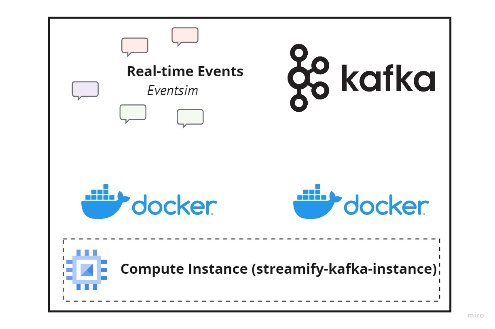

## Setup Kafka VM



We will setup Kafka and eventsim in two separate docker processes in a dedicated compute instance. Eventsim will communicate with port `9092` of the `broker` container of Kafka to send events.

- Establish SSH connection

  ```bash
  ssh streamify-kafka
  ```

- Clone git repo and cd into Kafka folder

  ```bash
  git clone https://github.com/tranthe170/spotify_data_pipeline.git
  ```

- Install anaconda, docker & docker-compose.

  ```bash
  bash ~/spotify_data_pipeline/scripts/vm_setup.sh && \
  exec newgrp docker
  ```

- Set the evironment variables -

  - External IP of the Kafka VM

    ```bash
    export KAFKA_ADDRESS=IP.ADD.RE.SS
    ```

    **Note**: You will have to setup these env vars every time you create a new shell session. Or if you stop/start your VM

- Start Kafka

  ```bash
  cd ~/spotify_data_pipeline/kafka && \
  docker-compose build && \
  docker-compose up
  ```

  **Note**: Sometimes the `broker` & `schema-registry` containers die during startup. You should just stop all the containers with `docker-compose down` and then rerun `docker-compose up`.

- The Kafka Control Center should be available on port `9021`. Open and check if everything is working fine.

- The messages should start flowing-in in a few minutes.

- You should see topic spotify

